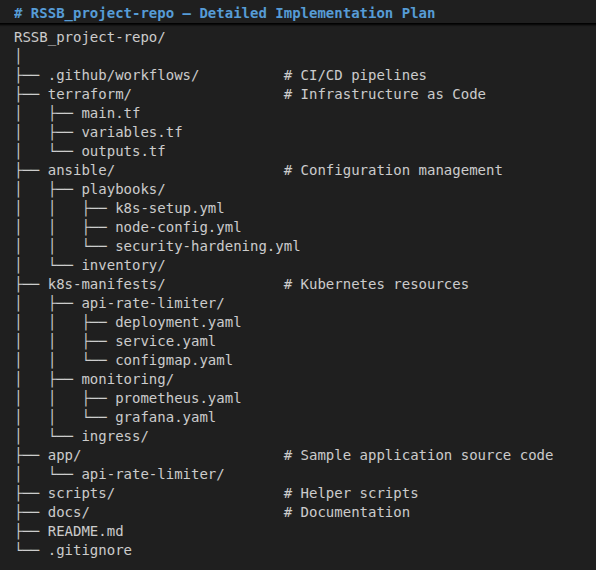
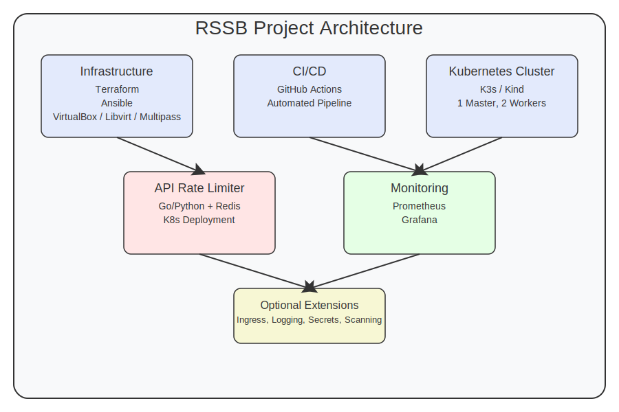

# Author: Jean René MUNYESHYAKA
# RSSB_project-repo

## Task 3: Automation & Monitoring
3.1 Implement a Kubernetes cluster deployed on a local machine or within a virtualized environment, using GitHub for version control and a CI/CD pipeline. Apply automation tools such as Terraform, Ansible, and Kubernetes manifests where applicable to provision the infrastructure, configure the cluster, and enforce security, consistency, and scalability. The solution should support hosting an example application, such as an API Rate Limiter hosted on GitHub or any other application of your choice.

3.2 Install a monitoring tool to monitor the health, performance, and security of the entire infrastructure (Network devices, Hosts, storage, Virtual Environment, Dockers, etc.), ensuring proactive issue resolution.


# RSSB_project-repo – Detailed Implementation Plan
1. Project Overview
Objective: Implement an automated, secure, scalable Kubernetes cluster on a local/virtualized environment with CI/CD, monitoring, and a sample application.
Tools: Terraform, Ansible, Kubernetes (K3s/Kind), GitHub Actions, Prometheus + Grafana, Docker.
Application Example: API Rate Limiter (Go/Python microservice).
Repo Name: RSSB_project-repo (public/private GitHub repository).

2. Repository Structure

RSSB_project-repo/
│
├── .github/workflows/          # CI/CD pipelines
├── terraform/                  # Infrastructure as Code
│   ├── main.tf
│   ├── variables.tf
│   └── outputs.tf
├── ansible/                    # Configuration management
│   ├── playbooks/
│   │   ├── k8s-setup.yml
│   │   ├── node-config.yml
│   │   └── security-hardening.yml
│   └── inventory/
├── k8s-manifests/              # Kubernetes resources
│   ├── api-rate-limiter/
│   │   ├── deployment.yaml
│   │   ├── service.yaml
│   │   └── configmap.yaml
│   ├── monitoring/
│   │   ├── prometheus.yaml
│   │   └── grafana.yaml
│   └── ingress/
├── app/                        # Sample application source code
│   └── api-rate-limiter/
├── scripts/                    # Helper scripts
├── docs/                       # Documentation
├── README.md
└── .gitignore




3. Step-by-Step Implementation Plan
Phase 1: Environment & Version Control Setup
Create GitHub Repository

Initialize RSSB_project-repo with README, .gitignore (Terraform, Python, etc.).

Set up branch protection rules (main branch).

Local Development Environment

Install VirtualBox/Vagrant or use Multipass for lightweight VMs.

Install required tools: Terraform, Ansible, kubectl, helm, Docker.

Phase 2: Infrastructure Provisioning with Terraform
Define Terraform Configuration (terraform/)

Provision 3 VMs (1 master, 2 workers) using a provider like libvirt, virtualbox, or proxmox.

Configure network, SSH keys, base OS (Ubuntu 22.04).

Output IP addresses for Ansible inventory.

Automate Terraform via GitHub Actions

Create workflow .github/workflows/terraform.yml to run terraform plan on PR, apply on merge to main.

Phase 3: Kubernetes Cluster Setup with Ansible
Ansible Playbooks (ansible/playbooks/)

k8s-setup.yml: Install K3s (lightweight Kubernetes) or use kubeadm.

node-config.yml: Join worker nodes, configure networking (Flannel/Calico), set up storage.

security-hardening.yml: Apply CIS benchmarks, set up RBAC, network policies.

Dynamic Inventory

Use Terraform outputs to generate Ansible inventory automatically.

CI Integration

Run Ansible playbook via GitHub Actions after Terraform apply.

Phase 4: CI/CD Pipeline for Application Deployment
Build Pipeline (.github/workflows/deploy-app.yml)

On push to main, build Docker image of API Rate Limiter.

Push image to Docker Hub/GitHub Container Registry.

Update Kubernetes manifests with new image tag.

Deploy to Kubernetes

Use kubectl apply or Helm to deploy updated manifests.

Rollback strategy on failure.

Sample Application: API Rate Limiter

Develop a simple Go/Python service with Redis for rate limiting.

Expose via Kubernetes Service (NodePort/LoadBalancer).

Phase 5: Monitoring Stack Deployment
Deploy Prometheus & Grafana

Use Helm charts or manifests in k8s-manifests/monitoring/.

Monitor: Node metrics, Pod health, network, storage.

Alerting & Dashboards

Configure Prometheus alerts for CPU, memory, disk, pod restarts.

Import Kubernetes dashboard in Grafana.

Logging (Optional)

Deploy EFK stack (Elasticsearch, Fluentd, Kibana) or Loki.

Phase 6: Security & Compliance
Network Policies

Restrict pod-to-pod communication.

Secrets Management

Use Kubernetes Secrets or HashiCorp Vault (optional).

Scanning

Integrate Trivy in CI to scan images for vulnerabilities.

Phase 7: Documentation & Validation
Update README with:

Setup instructions

How to access Grafana, API endpoint

Troubleshooting guide

Validation Scripts

Scripts to verify cluster health, application response, monitoring.

4. Timeline Estimates

5. Deliverables
GitHub Repository with full IaC and application code.

Working Kubernetes cluster on local/virtualized environment.

CI/CD pipeline automatically deploying updates.

Monitoring dashboard (Grafana) with key metrics.

API Rate Limiter service accessible via endpoint.

Documentation for setup, usage, and maintenance.

6. Optional Extensions
Implement GitOps with ArgoCD for continuous deployment.

Add HAProxy/Ingress-NGINX for ingress control.

Backup/restore strategy for cluster state (Velero).

Multi-environment setup (dev/staging/prod).


## 📋 Project Overview
Automated Kubernetes cluster deployment with CI/CD, monitoring, and security hardening. Hosts an API Rate Limiter as a sample application.

## 🏗️ Architecture


## 🚀 Quick Start

### Prerequisites
- VirtualBox 6.1+ / Multipass / Libvirt
- Terraform v1.5+
- Ansible 2.14+
- kubectl & Helm
- Docker

### Deployment Steps
1. Clone the repository
2. Configure variables in `terraform/variables.tf`
3. Run `terraform init && terraform apply`
4. Run Ansible playbooks
5. Deploy monitoring stack
6. Deploy sample application

## 📂 Repository Structure


## 🔧 Components
- **Infrastructure**: Terraform for VM provisioning
- **Configuration**: Ansible for K8s cluster setup
- **Application**: API Rate Limiter (Go/Redis)
- **CI/CD**: GitHub Actions for automated pipelines
- **Monitoring**: Prometheus + Grafana stack

## 📊 Monitoring
Access Grafana dashboard:
```bash
kubectl port-forward svc/grafana 3000:3000 -n monitoring